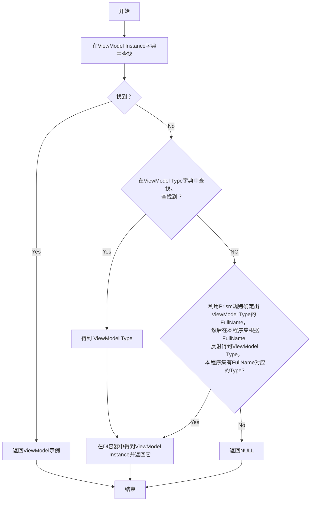
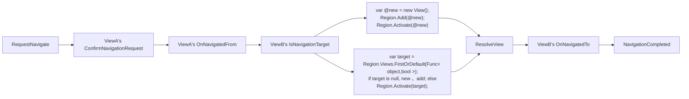
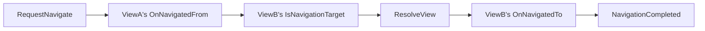
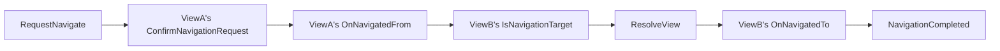

[TOC]

# Prism

## 整体架构

## IOC

依赖注入容器的使用要求：（1）在整个应用中，容器必须唯一(静态类或单例)，所有的注册和解析都发生在唯一容器实例上。（2）在应用的任何程序集中都可以访问到此唯一容器进行注册和解析。（虽然我个人倾向统一在exe程序集注册，比较好集中管理）。

Prism框架在Prism.dll(Nuget包名：Prism.Core)的静态类ContainerLocator，提供唯一容器实例，任何程序集下载Prism.Core Nuget包，就可以注册和解析类型。

```csharp
public static class ContainerLocator
{
    public static IContainerExtension Current { get; }
    public static IContainerProvider Container { get; }
    public static void SetContainerExtension(Func<IContainerExtension> factory);
    public static void ResetContainer();
}
```

Prism内置3个接口规范，IContainerRegistry负责注册，IContainerProvider负责解析，IContainerExtension接口集成了IContainerRegistry和IContainerProvider，只要实现IContainerExtension接口的类就可以作为Prism的底层容器。SetContainerExtension()传入具体容器类作为内部容器，Current和Container都是此容器引用，可以进行注册和解析。使用方法如下：

```csharp
ContainerLocator.SetContainerExtension(() => new DryIocContainerExtension()); // 选择容器
ContainerLocator.Current.Register<IDialogService, DialogService>(); // 注册
ContainerLocator.Current.Register<IEventAggregator, EventAggregator>(); // 注册
ContainerLocator.Container.Resolve<IEventAggregator>(); // 解析
```

DryIocContainerExtension是实现IContainerExtension接口，内部封装DryIoc实现其功能的容器类。
Prism框架还通过静态扩展方法对IContainerRegistry，IContainerProvider，IContainerExtension增加了更便捷更丰富集成度更高的注册和解析类型的方法，通过ContainerLocator.Current，ContainerLocator.Container，((IContainerExtension)ContainerLocator.Container)调用注册和解析方法时能够智能显示出比这3个接口包含的约束方法更多的方法。

## AutoWireViewModel

> Wire(用线缆连接，把电源插头插上) the `DataContext` of a view to an instance of a ViewModel using a standard naming convention。

### 2种为View赋予ViewModel的方式

**方式1：显示赋值**

示例一

```csharp
public MainView()
{
    InitializeComponent();
    this.DataContext = new MainViewModel();
}
```

示例二

```csharp
public MainView()
{
    InitializeComponent();
    this.DataContext = Container.Resolver<ViewModel>(new NamedParameter("fileName", "D:\\Config\\addr.json")); // 从DI容器解析时为构造方法传递常量实参
}
```

**方式2：利用Prism AutoWireViewModel**

示例一

```xml
<Window x:Class="PrismApplicationDemo.MainView"
        xmlns:prism="http://prismlibrary.com/"
        prism:ViewModelLocator.AutoWireViewModel="True">
</Window>
```

示例二

```csharp
public MainView()
{
    InitializeComponent();
    ViewModelLocator.SetAutoWireViewModel(this, true);
}
```

>- 选择其中一种方式即可，不可以同时使用(这样做没有意义)。
>- 不使用Prism AutoWireViewModel功能的View，不要添加附加属性ViewModelLocator.AutoWireViewModel，使用的则添加。
>- 既没选择方式1，也没选择方式2，那么View没有ViewModel，其DataContext是null。
>- 方式2可能因违背命名规约等原因导致Wire失败，Wire失败就成了一张没有ViewModel的View.
>- 没有ViewModel的View是允许的，比如，按照winform开发模式，逻辑写到View的.cs文件，那么这张View不需要ViewModel；如果View按照MVVM开发模式，逻辑写在ViewModel中，但是按照方式2定位失败，不会发生任何异常，只是得到一张`没有灵魂`的View，虽然接受了键鼠输入但是不会执行任何任务。

### Prism AutoWireViewModel流程图




### Prism AutoWireViewModel的具体实践

***Prism AutoWireViewModel功能只与两个类密切相关：ViewModelLocationProvider和ViewModelLocator。***

1. 重写App从PrismApplication那里继承来的方法ConfigureViewModelLocator()，完成Prism AutoWireViewModel基础服务后，开始享受吧。

```csharp
protected override void ConfigureViewModelLocator()
{
    // 基类方法的实现是从容器中获取ViewModel实例，代码是：ViewModelLocationProvider.SetDefaultViewModelFactory((object view, Type type) => Container.Resolve(type));所以总是调用基类方法base.ConfigureViewModelLocator();。
    // 如果不调用，Prism内置的是通过无参构造函数反射得到ViewModel实例，这种方式太烂了，如果ViewModel没有无参构造方法或构造方法含有需要借助DI容器拿到实参的接口形式的形参，就不行了。
    // 如果基类实现也不满足自己的需求，可以通过下面的代码行自己定制实例化ViewModel的策略
        // ViewModelLocationProvider.SetDefaultViewModelFactory((viewInstance, viewModelType) => { });
    base.ConfigureViewModelLocator();
   
    // 少量不遵守命名规约的ViewModel,单独注册到字典中，这样Prism直接从字典中检索出ViewModel实例或ViewModel Type，而不会运行规则费力解析ViewModel Type(也不可能解析成功，因为(强烈推荐)只有使用Prism AutoWireViewModel的View且其ViewModel又不遵守命名规约的ViewMoidel才会用这两行代码注册)
    ViewModelLocationProvider.Register<View1>(() => Container.Resolve<ViewModel1>());
    ViewModelLocationProvider.Register<View2,ViewModel2>();
    
    // 根据View推算ViewModel名称和所在程序集的规则。一般采用Prism内置的默认规则，不会自定义
    // 所以下面的代码行在实际开发种几乎都不需要输入。
    ViewModelLocationProvider.SetDefaultViewTypeToViewModelTypeResolver((viewType) =>
    {
        string viewFullName = viewType.FullName;
        Assembly assemblyIncludeView = viewType.Assembly;
        // 使用上述2个信息推导出ViewModel所在的程序集和类型名称，反射得到ViewModel Type并返回
        return viewModelType;
    });
}
```

静态类ViewModelLocationProvider维护一张View.GetType().ToString() --> ViewModel实例的映射表,一张View.GetType().ToString() --> ViewModel Type的映射表,根据View的FullName推算出ViewModel Type 的FullName的策略，还有一个根据ViewModel的Type构造出1个ViewModel实例的策略，最终得到适配View的ViewModel实例赋值给其DataContext.

*（Instance.GetType().ToString()的字符串是命名空间+类名，如System.IO.FileStream。）*


2. 在每个View中的XAML中

```xml
<Window x:Class="Demo.Views.MainWindow"
    ...
    xmlns:prism="http://prismlibrary.com/"
    prism:ViewModelLocator.AutoWireViewModel="True">
```

或

在每个View的CS文件合适的位置(一般是构造函数或Load函数)中

```csharp
ViewModelLocator.SetAutoWireViewModel(view,true);
```

### View.DataContext = GetViewModelInstance()的时机

View的附加属性ViewModelLocator.AutoWireViewModel设置成True时，会触发ViewModelLocationProvider去为View寻找合适的ViewModel实例。

```xml
<Window x:Class="Demo.Views.MainWindow"
    ...
    xmlns:prism="http://prismlibrary.com/"
    prism:ViewModelLocator.AutoWireViewModel="True">
```

**附加属性的定义细节被定义在ViewModelLocator类，重点是其元数据中的回调函数PropertyChangedCallback,它会在AutoWireViewModelProperty=True后被触发完成ViewModel的构建和DataContext的赋值。**

```csharp
public static class ViewModelLocator
{
    public static DependencyProperty AutoWireViewModelProperty = DependencyProperty.RegisterAttached("AutoWireViewModel", typeof(bool?), typeof(ViewModelLocator), new PropertyMetadata(defaultValue: null, propertyChangedCallback: AutoWireViewModelChanged));
}
```

**分析ViewModelLocator的方法AutoWireViewModelChanged**

```csharp
private static void AutoWireViewModelChanged(DependencyObject d, DependencyPropertyChangedEventArgs e)
{
_WINUI
    if (!DesignerProperties.GetIsInDesignMode(d))

    {
        var value = (bool?)e.NewValue;
        if (value.HasValue && value.Value) // View的依赖属性AutoWireViewModelProperty被赋值成True时才会真的去寻找合适ViewModel实例作为其DataContext。View不添加附加属性或添加附加属性但初值是False，Prism都不会为View自动构建ViewModel.
        {
            ViewModelLocationProvider.AutoWireViewModelChanged(d, Bind); // d是View实例，根据View.GetType().ToString()和View的FullName构建出适配的ViewModel，然后Bind方法完成View.DataContext=ViewModel.
        }
    }
}

static void Bind(object view, object viewModel)
{
    if (view is FrameworkElement element) // 只要是FrameworkElement，就可以做View。(WPF元素继承链从FrameworkElemt开始才具有DataContext属性)。
        element.DataContext = viewModel;
}

```

View的附加属性ViewModelLocator.AutoWireViewModel设置成True时，才会触发构建ViewModel实例并完成View.DataContetx=ViewModel。按照习惯，通常在XAML中添加`prism:ViewModelLocator.AutoWireViewModel="True"`,所以一般是在View的构造函数中完成DataContext的赋值的。我们完全可以挪到View的Load函数中：`ViewModelLocator.SetAutoWireViewModel(view,true);`

### 获取ViewModel实例的步骤

```csharp
public static void AutoWireViewModelChanged(object view, Action<object, object> setDataContextCallback)
{
    // Try mappings first
    object viewModel = GetViewModelForView(view); // 检查ViewModel Instance缓存

    // try to use ViewModel type
    if (viewModel == null)
    {
        //check type mappings
        var viewModelType = GetViewModelTypeForView(view.GetType()); // 检查ViewModel Type缓存

        // fallback to convention based
        if (viewModelType == null)
            viewModelType = _defaultViewTypeToViewModelTypeResolver(view.GetType()); // 根据命名规约解析出ViewModel Type

        if (viewModelType == null)
            return;
        // 实例化ViewModel
        viewModel = _defaultViewModelFactoryWithViewParameter != null ? _defaultViewModelFactoryWithViewParameter(view, viewModelType) : _defaultViewModelFactory(viewModelType);
    }

    // 完成DataContext = ViewModel
    setDataContextCallback(view, viewModel);
}
```

以View.GetType().ToString()为Key，在字典(Dictionary<string, Func\<object>>中寻找返回ViewModel实例的Func，拿到ViewModel实例。

上一步成功，直接View.DataContext = ViewModel. 上一步失败，下一步先确定View所需要的ViewModel的类型，拿到类型再实例化。

以View.GetType().ToString()为Key，去字典(Dictionary<string, Type>())中找到ViewModel的Type.

上一步成功，直接跳到根据Type实例化ViewModel的步骤，否则，利用View和ViewModel间的命名规约继续确认ViewModel的Type.

如果默认规则成功确定Type，则实例化完成Wire，否则，因无法得到ViewModel实例导致一张DataContext为NULL的View诞生。(并不会抛出异常提醒，这是合理的，可能有的View没遵守MVVM开发，后台逻辑放到View的XAML和CS文件中了)。

### Prism确认ViewModel Type的规则

```csharp
static Func<Type, Type> _defaultViewTypeToViewModelTypeResolver =
    viewType =>
    {
        var viewName = viewType.FullName;
        viewName = viewName.Replace(".Views.", ".ViewModels.");
        var viewAssemblyName = viewType.GetTypeInfo().Assembly.FullName;
        var suffix = viewName.EndsWith("View") ? "Model" : "ViewModel";
        var viewModelName = String.Format(CultureInfo.InvariantCulture, "{0}{1}, {2}", viewName, suffix, viewAssemblyName);
        return Type.GetType(viewModelName);
    };
```

先确定ViewModel的FullName字符串，即Namespace和Name.

**ViewModel的名称**

1. View如果以View结尾，追加Model，否则追加ViewModel。

例：

EmployeeList，则ViewModel是EmployeeListViewModel

EmployeeListView，则ViewModel是EmployeeListViewModel

**ViewModel命名空间**

将View命名空间中的Views替换成ViewModels即可。如果View的命名空间没有Views字眼，那么ViewModel的命名空间和View的一模一样。

例：

A.B.Views.EmployeeList        A.B.ViewModels.EmployeeListViewModel

A.B.EmployeeListView        A.B.EmployeeListViewModel

2. 在View所在程序集中寻找FullName是上一步得到的FullName字符串的Type。存在这样的Type，则实例化作为DataContext，否则View的DataContext为NULL。

**小结**

`View的名称可以带View也可以不带View，但ViewModel一定要以ViewModel结尾。`

`Prism默认的确认ViewModel策略与文件夹无关，只与命名空间有关，只是命名空间受文件夹影响而已。`

### 实例化ViewModel策略

从类型字典查出或命名规约解析出ViewModel的Type后，下一步就是构造ViewModel实例。ViewModelLocationProvider有2个静态的委托成员，决定如何实例化ViewModel.
```csharp
static Func<Type, object> _defaultViewModelFactory = type => Activator.CreateInstance(type);
static Func<object, Type, object> _defaultViewModelFactoryWithViewParameter;
```
实例化ViewModel的代码如下：
```csharp
viewModel = _defaultViewModelFactoryWithViewParameter != null ? _defaultViewModelFactoryWithViewParameter(view, viewModelType) : _defaultViewModelFactory(viewModelType);
```
上述是Prism的默认实现，可以看到defaultViewModelFactoryWithViewParameter是NULL，所以采用的是defaultViewModelFactory构造ViewModel实例。但defaultViewModelFactory只是利用反射调用ViewModel的无参构造函数实例化，缺点就是如果ViewModel的不含无参构造函数，或者想利用有参构造函数实例化，又或者ViewModel的构造函数含有需要借助依赖注入容器解析出实现的形参，这些_defaultViewModelFactory都做不到，所以我们在基于Prism框架开发WPF应用时总是会重写实例化策略。

```csharp
ViewModelLocationProvider.SetDefaultViewModelFactory(viewModelType) =>
    {
        return viewModel instance;
    });


ViewModelLocationProvider.SetDefaultViewModelFactory((view, viewModelType) =>
    {
        switch (view)
        {
            case Window window:
                //your logic
                break;
            case UserControl userControl:
                //your logic
                break;
        }
           return viewModel instance;
    }
```

上述代码完成对委托类型的静态字段defaultViewModelFactoryWithViewParameter和defaultViewModelFactory的赋值。实现其中任意1个就可以了，如果2个都实现，Prism也只会优先仅使用defaultViewModelFactoryWithViewParameter。2者之间的差别就是前者的参数多个View，如果需要的话，在内部可利用View做一些额外的判断，仅此而已。

###  开发规范

1. 尽量所有的View和其ViewModel都遵守命名规约，有利于强制团队成员规范项目文件夹结构。

   > View和ViewModel的命名空间完全相同，除了Views和ViewModels字符串不匹配是允许的，且ViewModel的命名空间不能包含.Views.；View的名称无要求，但习惯是以View结尾，但ViewModel名称必须以ViewModel结尾，并且View和其ViewModel在同一个程序集。（如果不在，需要重写Prism内置的解析ViewModel Type的规则）


   假设

   View命名空间：            A.B.C.D.E

   ViewModel命名空间： a.b.c.d.e

   必须满足：View点分成5段，ViewModel也必须要点分成5段。对应序号的段相互比较(A和a比较，B和b比较...)，必须完全相同，除非View段是Views，ViewModel段是ViewModels也被认为段相同，其他情况一律是段不同匹配失败！

---

下面的例子是合规的，即使Views和ViewModels不在命名空间的末尾。

```tex
View :       A.B.Views.C.EmployeeListView

ViewModel :  A.B.ViewModels.C.EmployeeListViewModel

下面的例子也是合规的，即使View文件不以View结尾。

View :       A.B.EmployeeList

ViewModel :  A.B.EmployeeListViewModel
```

2. 尽可能让更多的View使用AutoWireViewModel功能

```csharp
// 将不遵守命名规约的ViewModel的Type添加到字典，不让Prism费劲去分析FullName。下面两个方法等价

ViewModelLocationProvider.Register(typeof(MainWindow).ToString(), typeof(CustomViewModel));

ViewModelLocationProvider.Register<MainWindow, CustomViewModel>();

// 甚至还可以将不遵守命名规约的ViewModel的工厂委托添加到字典，一步到位，相比前者，连根据ViewModel Type实例化ViewModel这一步都省了。下面两个方法等价

ViewModelLocationProvider.Register(typeof(MainWindow).ToString(), () => Container.Resolve<CustomViewModel>());

ViewModelLocationProvider.Register<MainWindow>(() => Container.Resolve<CustomViewModel>());
```

3. `鼓励所有的View，不管其是否使用了Prism AutoWireViewModelView功能，尽可能的将其ViewModel先注册到DI容器中，需要ViewModel实例时从DI容器中取。虽然这不是必须的，但这样可以充分利用依赖注入机制开发我们的应用程序！`


## Dialog Service

### 快速入门

如果要使用Prism的对话框服务，在制作一个新弹窗时，`思路并不是新建一个Window`，而是新建一个用户控件，用户控件包含弹窗要展示的内容，然后将用户控件通过RegisterDialog\<TView>()注册。DialogService.Show()时指定Window和用户控件即可，Prism会将二者组装成弹窗展示出来。多说一点，只要是FrameworkElement都可以注册作为弹窗的内容，只是绝大部分使用情况需要使用用户控件组合很多控件才能达到我们想要展示的弹窗内容。另外，用户控件不需要添加附加属性ViewModelLocator.AutoWireViewModel="True"，因为Prism弹窗时，会自动为用户控件添加该属性的。

通过RegisterDialogWindow\<TWindow>()将项目中用到的Window全部注册。

```csharp
ContainerLocator.Current.Register<IDialogService, DialogService>();
// 注册Window
ContainerLocator.Current.RegisterDialogWindow<CustomDialogWindow1>("1");
ContainerLocator.Current.RegisterDialogWindow<CustomDialogWindow2>("2");
ContainerLocator.Current.RegisterDialogWindow<CustomDialogWindow3>("3");
ContainerLocator.Current.RegisterDialogWindow<DialogWindow>(); // 最常用的Window可以不传name(Key=null)

// 注册Window内容控件
ContainerLocator.Current.RegisterDialog<ViewOne>("one");
ContainerLocator.Current.RegisterDialog<ViewTwo>("two");
ContainerLocator.Current.RegisterDialog<ViewThree>("three");
ContainerLocator.Current.RegisterDialog<ViewFour>();

// 使用
DialogService.ShowDialog("one",null,null,"1"); // ViewOne + CustomDialogWindow1
DialogService.ShowDialog("two",null,null,"2"); // ViewTwo + CustomDialogWindow2
DialogService.ShowDialog("three",null,null,"3"); // ViewThree + CustomDialogWindow3
DialogService.ShowDialog("four",null,null); // ViewFour + DialogWindow
DialogService.ShowDialog(null); // ViewFour + DialogWindow
```

**DialogControl的ViewModel必须要实现接口IDialogAware !!!**

```csharp
public interface IDialogAware
{
    string Title { get; }
    event Action<IDialogResult> RequestClose;
    bool CanCloseDialog();
    void OnDialogClosed();
    void OnDialogOpened(IDialogParameters parameters);
}
```

### 案例


```csharp
public class MainWindowViewModel
{
    private readonly IDialogService _dialogService;

    public MainWindowViewModel(IDialogService dialogService)
    {
        _dialogService = dialogService;
        ShowAddCommand = new DelegateCommand(() =>
        {
            IDialogParameters parameters = new DialogParameters();
            parameters.Add("initial data", 8888);

            _dialogService.ShowDialog("add", parameters, (dialogResult) =>
            {
                if (dialogResult.Result == ButtonResult.None)
                {
                    Console.WriteLine("用户点击了窗体右上角的叉号关闭弹窗");
                    return;
                }

                if (dialogResult.Result == ButtonResult.OK)
                {
                    IDialogParameters parameters = dialogResult.Parameters;
                    string name = parameters.GetValue<string>("name");
                    int age = parameters.GetValue<int>("age");
                    Console.WriteLine("用户点击了提交按钮从而关闭了弹窗");
                    return;
                }

                if (dialogResult.Result == ButtonResult.Cancel)
                {
                    Console.WriteLine("用户点击了取消按钮从而关闭了弹窗");
                }
            });
        });
    }
}
```

```csharp
public class AddUserViewModel : BindableBase, IDialogAware
{
    public DelegateCommand SubmitCommand { get; }
    public DelegateCommand CancelCommand { get; }

    public AddUserViewModel()
    {

        SubmitCommand = new DelegateCommand(() =>
        {
            IDialogParameters parameters = new DialogParameters();
            parameters.Add("name", "张三");
            parameters.Add("age", 17);
            RequestClose?.Invoke(new DialogResult(ButtonResult.OK, parameters));
        });

        CancelCommand = new DelegateCommand(() =>
        {
            RequestClose?.Invoke(new DialogResult(ButtonResult.Cancel, null));
        });
    }

    public bool CanCloseDialog()
    {
        return true;
    }

    public void OnDialogClosed()
    {
        // 在这里不要改变Window.Result的值
    }

    public void OnDialogOpened(IDialogParameters parameters)
    {
        int data = parameters.GetValue<int>("initial data");
        Title = data.ToString();
    }

    public string Title { get; set; }

    public event Action<IDialogResult>? RequestClose;
}
```


### Prism的对话框服务的实现机制

弹窗可拆分成2个控件：Window控件和其盛放的内容控件(`后续称DialogControl`)。(内容控件是指作为Window的Content的控件，不是指ContentControl。)

```csharp
Window window = new Window();
window.Content = (object)FrameworkElement;
Window.ShowDialog();
```

Prism提供的对话框服务，先在依赖注入容器中找到Window实例，然后将ViewModel实现的IDialogAware的接口方法全部注册到Window生命周期事件中，最后再在容器中找到作为Window内容控件的FrameworkElement(一般是UserControl)，最后弹出窗体。

1. Window必须实现IDialogWindow接口
2. DialogControl必须是FrameworkElement(几乎都是UserControl)，且其ViewModel必须实现IDialogAware接口。
3. DialogControl不需要添加附加属性ViewModelLocator.AutoWireViewMode=true.因为在Prism弹窗时，会自动添加此属性并设置成true，也就是说，`DialogControl定位ViewModel的方式采用的是Prism的机制，想不用都不行。`
4. Window在容器中的存储方式：[IDialogWindow + Key] ->List< Func\<Window>>。`IService是死的`。不同类型的Window需要有唯一的name(Key)与其对应。
5. DialogControl在容器中的存储方式：[Object + Key] ->List< Func\<Framework>>。`IService是死的`。不同类型的DialogControl需要有唯一的name(Key)对应。
6. RegisterDialogWindow\<TWindow>("key"); RegisterDialog\<TView>("key"); 多次使用相同的name注册Window或DialogControl，后注册的生效。
7. 虽然DialogControl和Window是在容器中获得的，其实与依赖注入没什么关系，更像是按字符串索引实例，像是在字典Dictionary<string,FrameworkElement>根据Key找Value。
8. DialogService.ShowDialog()或Show()，一定会新产生1个Window实例和1个DialogControl实例，至于ViewModel则不一定是新构建的，这取决于DialogControl的ViewModel在容器中的注册方式。
9. Window的Load方法和ShowDialog()方法晚于OnDialogOpened执行。

<table><td bgcolor=gray>弹窗API</td></table>

```csharp
void DialogService.ShowDialog(string name, IDialogParameters parameters, Action<IDialogResult> callback, string windowName);
```

通过分析ShowDialog源码，可以知晓其实现机制，完全掌握对话框服务知识点。

<div align="center"></div>


```csharp
public void ShowDialog(string name, IDialogParameters parameters, Action<IDialogResult> callback, string windowName)
{
    // ViewModel的OnDialogOpen(IDialogParameter parameters)的参数来自parameters，所以，即使ShowDialog不提供参数，parameters是空集合不是null.
    if (parameters == null)
        parameters = (IDialogParameters)new DialogParameters();

    // 从容器中获取Window实例
    // windowName是null时，相当于 Key=null,IService=IDialogWindow,拿到的是Prism内置的DialogWindow
    // windowName不是null时,相当于 Key=windowName,IService=Object，可以拿到第三方定制的Window
    // 注册窗体时，不能注册多个key相同的窗体，因为Iservice全当Object处理，后注册的生效，先注册的失效。
    IDialogWindow dialogWindow = string.IsNullOrWhiteSpace(windowName) ? this._containerExtension.Resolve<IDialogWindow>() : this._containerExtension.Resolve<IDialogWindow>(windowName);

    // 
    // 在Window的Load事件中，注册RequestClose。
    // 调用RequestClose，会先把参数赋值给Window的属性Result，然后调用Window的Close方法将窗口关闭。
    // RequestClose是ViewModel的成员，此注册，使ViewModel具备关闭窗口的能力。
    dialogWindow.Loaded += (o, e) =>
    {
        dialogWindow.Loaded -= loadedHandler;
        dialogWindow.GetDialogViewModel().RequestClose += (0)=>
        {
            dialogWindow.Result = o;
            dialogWindow.Close();
        }
    };

    // CanCloseDialog() 在Window的Closing事件中执行
    dialogWindow.Closing += (o, e) =>
    {
        if (dialogWindow.GetDialogViewModel().CanCloseDialog())
            return;
        e.Cancel = true;
    };

    // OnDialogClosed() 在Closed中执行
    // DialogService.Show()传入的窗体关闭后执行的callback在Closed中执行。
    dialogWindow.Closed += () =>
    {
        dialogWindow.GetDialogViewModel().OnDialogClosed();
        if (dialogWindow.Result == null)
            dialogWindow.Result = (IDialogResult)new DialogResult();
        Action<IDialogResult> action = callback;
        if (action != null)
            action(dialogWindow.Result);
    };

    // 从容器中获取Window的内容控件(一般是UserControl)
    // 注册作为弹窗内容控件的时，不需要指定IService，只需要指定Key即可
    // 不可以多次使用Key相同的注册，后者会覆盖前者
    if (!(this._containerExtension.Resolve<object>(dialogName) is FrameworkElement frameworkElement))
        throw new NullReferenceException("A dialog's content must be a FrameworkElement");
    // View不需要添加附加属性，会自动寻找DataContext
    ViewModelLocator.SetAutoWireViewModel((DependencyObject)frameworkElement, new bool?(true));
    // 检查ViewModel是否继承了IDialogAware
    if (!(frameworkElement.DataContext is IDialogAware dataContext))
        throw new NullReferenceException("A dialog's ViewModel must implement the IDialogAware interface");
    // 设置Window的Style
    Style windowStyle = Dialog.GetWindowStyle((DependencyObject)dialogContent);
    if (windowStyle != null)
        window.Style = windowStyle;
    // 完成内容控件的组装
    window.Content = (object)dialogContent;
    // 把内容控件的DataContext升级到Window层
    window.DataContext = (object)viewModel;

    // 保证每个弹窗都有Owner
    // 如果没有设置Owner，就以IsActive=True的窗体为其Owner，一般就是被点击导致弹出窗体的那个窗体
    if (window.Owner != null)
        return;
    IDialogWindow dialogWindow = window;
    Application current = Application.Current;
    Window window1 = current != null ? current.Windows.OfType<Window>().FirstOrDefault<Window>((Func<Window, bool>)(x => x.IsActive)) : (Window)null;
    dialogWindow.Owner = window1;
    
    // 执行ViewModel的IDialogAware接口方法
    d.OnDialogOpened(parameters);
    
    // 弹窗，这里会执行Window的Load方法。Load方法晚于OnDialogOpened执行。
    dialogWindow.ShowDialog();
}
```

### prerequisites

1. 依赖注入容器的内部构造

> `Dictionary<key + IService , List<Func<Service>>>`
>
> 注册时，需要指明key和IService，省略key，key是null，省略IService,IService是object.
>
> 解析时，需要指明key和IService，省略key，key是null，省略IService,IService是object.
>
> 多次注册，无论是RegisterInstance，RegisterSingleton，RegisterTransient，RegisterScoped或者其他任何注册方法，本质都是在List<Func\<Service>>中追加1个构造Service的委托工厂而已，这些工厂有的是始终吐出同一个实例，有的是每次都吐出一个全新的实例等等。解析时，使用的是List中最末尾的那个委托工厂构造Service。

### 如何寻找Window

可作为Prism对话框服务的窗体必须实现`IDialogWindow`接口。

Prism以[IService=IDialogWindow & Key=windowName]在容器中获得Window实例。

```csharp
protected virtual IDialogWindow CreateDialogWindow(string name) => string.IsNullOrWhiteSpace(name) ? this._containerExtension.Resolve<IDialogWindow>() : this._containerExtension.Resolve<IDialogWindow>(name);
```

如果DialogService.ShowDialog() 不传参windowName，则windowName值是NULL，解析到的Window是以`ContainerLocator.Current.Register<IDialogWindow, DialogWindow>()`形式注册的Window类型。

### 什么是IDialogWindow接口

Prism约定每个窗体都有Result属性，这个Result包含窗体操作完成被关闭后想要传出的结果参数。IDialogWindow强制约束每个Window都有Result属性，以便窗体被关闭后传出结果，发起弹窗者可以在窗体关闭后，通过Window.Result捕获结果。至于IDialogWindow约束的其他属性和方法，都是WPF内置的Window本身就具备的，而我们制作第三方Window类型时必然会继承Window，所以，想要制作可以被Prism对话框服务使用的窗体非常简单：

XAML代码不需要动，CS代码添加接口IDialogWindow即可。

```csharp
class CustomDialogWindow:Window,IDialogWindow
{
    public IDialogResult Result { get; set; }
}
```

### DialogWindow是什么

DialogWindow是Prism内置的实现了IDialogWindow接口的Window，它和原生的WPF Window几乎没有差别，一般会把DialogWindow注册成对话框服务默认的窗体类型。

`ContainerLocator.Current.RegisterDialogWindow<DialogWindow>();`

### 如何添加第三方Window

调用下面2个Prism提供的API，相比于直接调用containerRegistry.Register(typeof(Services.Dialogs.IDialogWindow), typeof(TWindow))，优点是这2个API的泛型约束可以防止我们将未实现IDialogWindow接口的Window注册进容器。

```csharp
public static void RegisterDialogWindow<TWindow>(this IContainerRegistry containerRegistry) where TWindow : Services.Dialogs.IDialogWindow
{
     containerRegistry.Register(typeof(Services.Dialogs.IDialogWindow), typeof(TWindow));
}

public static void RegisterDialogWindow<TWindow>(this IContainerRegistry containerRegistry, string name) where TWindow : Services.Dialogs.IDialogWindow
{
     containerRegistry.Register(typeof(Services.Dialogs.IDialogWindow), typeof(TWindow), name);
}
```

### 注册Window的注意项

不同类型的Window在注册时使用不同的Name。如果多次注册Name相同的WIndow，以最后一次为效。

```c#
ContainerLocator.Current.RegisterDialogWindow<CustomDialogWindow1>();
ContainerLocator.Current.RegisterDialogWindow<CustomDialogWindow2>();
ContainerLocator.Current.RegisterDialogWindow<CustomDialogWindow3>();
ContainerLocator.Current.RegisterDialogWindow<CustomDialogWindow3>("3");
ContainerLocator.Current.RegisterDialogWindow<CustomDialogWindow2>("3");
ContainerLocator.Current.RegisterDialogWindow<CustomDialogWindow1>("3");

dialogService.ShowDialog("",null,null);      // 得到的是CustomDialogWindow3
dialogService.ShowDialog("",null,null,"3");  // 得到的是CustomDialogWindow1
```

<table><td bgcolor=gray>推荐的注册对话框Window的方式</td></table>

```csharp
ContainerLocator.Current.RegisterDialogWindow<CustomDialogWindow1>("1");
ContainerLocator.Current.RegisterDialogWindow<CustomDialogWindow2>("2");
ContainerLocator.Current.RegisterDialogWindow<CustomDialogWindow3>("3");
ContainerLocator.Current.RegisterDialogWindow<CustomDialogWindow>(); // 经常使用的Window可以缺省name参数，这样DialogService.ShowDialog()可以不用对windowName传参。
```

### 如何寻找DialogControl

```csharp
_containerExtension.Resolve<object>(dialogName)；
```

上述是Prism寻找DialogControl的源码，可见完全靠Name，和IService无关，所以建议，注册DialogControl时，都指定Name。

下面是注册DialogControl的2个API.

```csharp
public static void RegisterDialog<TView>(this IContainerRegistry containerRegistry, string name = null)
{
    containerRegistry.RegisterForNavigation<TView>(name);
}

public static void RegisterDialog<TView, TViewModel>(this IContainerRegistry containerRegistry, string name = null) where TViewModel : Services.Dialogs.IDialogAware
{
    containerRegistry.RegisterForNavigation<TView, TViewModel>(name);
}
```

第1个API会按照定位ViewModel的策略寻找其ViewModel，所以记得将ViewModel事先注册到容器。

第2个API，相当于ViewModelLocationProvider.Register(typeof(TView).ToString(), typeof(TViewModel))，不劳烦Prism费劲寻找ViewModel Type。

### 定制Window的样式

Prism把Window和DialogControl组装在一起弹出。通过为DialogControl添加附加属性Dialog.WindowStyle(数据类型是Style)，可以改变承载它的Window的属性。

```xml
<prism:Dialog.WindowStyle>
    <Style TargetType="Window">
        <Setter Property="WindowStartupLocation" Value="CenterScreen" />
        <Setter Property="ResizeMode" Value="NoResize"/>
        <Setter Property="ShowInTaskbar" Value="False"/>
        <Setter Property="SizeToContent" Value="WidthAndHeight"/>
    </Style>
</prism:Dialog.WindowStyle>
```

### 设置弹窗的初始位置

Window的WindowStartupLocation属性是个枚举类型，可以设置窗体弹出来的初始位置。

```csharp
public enum WindowStartupLocation
{
    Manual = 0,
    CenterScreen = 1,
    CenterOwner = 2
}
```

```csharp
Window w = new Window();
w.WindowStartupLocation = WindowStartupLocation.CenterOwner;
```

但由于它不是依赖属性，所以无法通过上面prism:Dialog.WindowStyle来设置Window的初始位置(Style.Setter.Property必须是依赖属性)。

但是Prism内置了附加属性Dialog.WindowStartupLocation，它的元数据的PropertyChangedCallback，会修改(枚举类型)Window.WindowStartupLocation。

<font color=red>**下面的写法是正确的**</font>

```xml
<prism:Dialog.WindowStyle>
    <Style TargetType="Window">
        <Setter Property="prism:Dialog.WindowStartupLocation" Value="CenterScreen" />
    </Style>
</prism:Dialog.WindowStyle>
```

<font color=red>**下面的写法是错误的**</font>

```xml
<prism:Dialog.WindowStyle>
    <Style TargetType="Window">
        <Setter Property="WindowStartupLocation" Value="CenterScreen" />
    </Style>
</prism:Dialog.WindowStyle>
```

### 关闭弹窗的2种方式

方式一：在ViewModel中调用RequestClose(IDialogResult result)

```csharp
RequestClose += { Window.Result = new DialogResult(); Window.Close(); }
```

ViewModel的事件成员RequestClose已经被Window注册，所以，本质上还是调用Window.Close()把窗体关闭的。

方式二：用户点击窗体右上角叉号

Window响应鼠标，自动调用Window.Close()把自己关闭。

**两种方式的差别**

第一种方式可以对Window.Result自由赋值，传出一些数据。第二种方式没有机会对Window.Result赋值，默认的Result的值是ButtonResult=None，DialogParameters=new DialogParameters( )，这种效果很像第一种方式点击了取消按钮。

### Window.Result的生命历程

如果是通过ViewModel调用RequestClose?.Invoke(new DialogResult())关闭窗口，Window.Result的赋值发生在Window.Close()前一刻；

```csharp
dialogWindow.Loaded += {
    DataContext.RequestClose += (IdialogResult result)
        dialogWindow.Result = result;
        dialogWindow.Close();
}
```

如果通过点击窗口右上角叉号关闭窗口，是在Window.Close()后，调用Window.Result=new DialogResult( )完成赋值。窗体被关闭后，立刻执行DialogService.ShowDialog() API的第3个委托类型参数callback，其实参是Window.Result。

```csharp
dialogWindow.Closed += ()=> {
    
    dialogWindow.GetDialogViewModel().OnDialogClosed();
    
        if (dialogWindow.Result == null)
          dialogWindow.Result = (IDialogResult) new DialogResult();
    
        Action<IDialogResult> action = callback;
        if (action != null)
          action(dialogWindow.Result);
}
```

**Load可以在构造函数中被注册，但是Load 事件是在 View New完成后，等Show指定过程中才会被执行。 不调用Show，Load不会被执行。**

### 简化对话框服务API

```csharp
dialogService.ShowDialog("NotificationDialog", new DialogParameters($"message={message}"), callBack, "notificationWindow");
```

我们要费心想一下DialogControl和Window在容器中的Key分别是什么,而且不能敲错Key字符串("NotificationDialog"和"notificationWindow")，心好累。

经常使用的弹窗可以通过静态扩展方法简化调用。

```csharp
public static class DialogServiceExtensions
{
    public static void ShowNotification(this IDialogService dialogService, string message, Action<IDialogResult> callBack)
    {
        dialogService.ShowDialog("NotificationDialog", new DialogParameters($"message={message}"), callBack, "notificationWindow");
    }
}
```

## Region

### 快速入门

**程序启动后主界面默认显示ViewA，点击按钮，显示ViewC.**

**View**

```xaml
<Window
    x:Class="PrismRegion.Views.MainWindow"
    xmlns="http://schemas.microsoft.com/winfx/2006/xaml/presentation"
    xmlns:x="http://schemas.microsoft.com/winfx/2006/xaml"
    xmlns:i="http://schemas.microsoft.com/xaml/behaviors"
    xmlns:prism="http://prismlibrary.com/"
    Title="{Binding Title}"
    Width="525"
    Height="350"
    prism:ViewModelLocator.AutoWireViewModel="True">
    <i:Interaction.Triggers>
        <i:EventTrigger EventName="Loaded">
            <i:InvokeCommandAction Command="{Binding LoadCommand}" />
        </i:EventTrigger>
    </i:Interaction.Triggers>
    <Grid>
        <Grid.RowDefinitions>
            <RowDefinition />
            <RowDefinition Height="Auto" />
        </Grid.RowDefinitions>
        <ContentControl x:Name="ContentControl" prism:RegionManager.RegionName="ContentRegion" />
        <Button
            Grid.Row="1"
            Command="{Binding ClickCommand}"
            Content="Click" />
    </Grid>
</Window>
```

***ViewModel**

```c#
public class MainWindowViewModel : BindableBase
{
    public DelegateCommand ClickCommand { get; set; }
    public DelegateCommand LoadCommand { get; set; }
    private readonly IRegionManager _regionManager;

    public MainWindowViewModel(IRegionManager regionManager)
    {
        _regionManager = regionManager;

        LoadCommand = new DelegateCommand(() =>
        {
            IRegion region = _regionManager.Regions["ContentRegion"];
            // Region关联存储Views，后续可使用
            region.Add(new ViewA());
            region.Add(new ViewB());
            region.Add(new ViewC());
        });

        ClickCommand = new DelegateCommand(() =>
        {
            IRegion region = _regionManager.Regions["ContentRegion"];
            region.Activate(region.Views.ElementAt(2)); // 展示ViewC
        });
    }
}
```

### IRegion和IRegionManager

> 界面布局规划完毕后，下一步就是在不同区域放置合适的元素。有的区域放置的元素是固定的，比如账号管理登录登出区域；有的区域放置的元素是不固定的，如导航的展示区域，又或者根据配置在运行时决定动态生成多少元素放置到该区域，如根据配置文件中配置的需要展示出来的部门决定生成几张选项卡TabItem(选项卡内容展示部门的员工信息)。对于View中需要动态展示（更替，增删）的区域，Prism创造了IRegion和IRegionManager来方便我们开发。
>
> 在动态区域放置一个合适的已经实现了RegionAdapter的控件，然后为此控件添加附加属性RegionManager.RegionName，那么此控件便被添加到IRegionManager的Regions中，在整个应用程序中可访问。通过RegionName索引到区域后，可以在此区域进行Add，Remove，Activate，Deactivate操作，View如何作用到此区域的控件上，取决于控件对应的RegionAdapter的实现。
>
> Region是应用程序UI的逻辑区域（具体表现为内容控件和列表控件(每个条目是一个内容控件)），Views能在Regions编程或者自动呈现，Prism也提供了Region导航的支持。这么设计主要是为了解耦让内容显示灵活具有多样性。
>
> View实例的销毁和新建，既重要又不重要。不重要是因为ViewModel实例不变(单例)，View是不是新建的，展示的内容并无差异；重要又是因为在View被销毁时，要记得从全局Region中删除。其次Load和Unload事件可能对应ViewModel的一些方法。
>
> IRegionManger的Regions存储着整个应用程序的Region，添加附加属性的控件都将被存放到此处，在应用程序任何地方都可以被访问。
>
> IRegion可以Add，Remove，Activate，Deactivate控件，RegionAdapter会监控Views和ActiveView的集合变化控件，决定如何操纵区域容器和新增控件。这完全取决于RegionAdapter被程序员如何实现的。
>
> 当View实例被丢弃时，应当从Regions中删除，否则，不再使用但是一直可以被访问到，造成内存泄漏，第二，再次实例化会注册同名的Region，会抛出重复名称异常。


| 成员                               | 作用 |
| ---------------------------------- | ---- |
| IRegionCollection Regions { get; } |      |
|                                    |      |
|                                    |      |
|                                    |      |
|                                    |      |
|                                    |      |
|                                    |      |
|                                    |      |
|                                    |      |


### 新增Region

添加附加属性`RegionManager.RegionName`的控件可作为区域，前提控件必须实现并注册了对应的RegionAdapter。运行时，附加属性赋值操作触发回调函数，会把控件、RegionAdapter、Region标识符捆绑在一起，注册进应用全局管理中心`IRegionManager`，后续通过`IRegionManager.Regions[标识符]`可捕获区域进而控制区域。

**XAML**

 ```xml
 <ContentControl x:Name="ContentControl" prism:RegionManager.RegionName="ContentRegion" />
 ```

**Code-Behind**

```c#
RegionManager.SetRegionName(ContentControl, "ContentRegion");
```

---

对区域的操作有AddView，RemoveView，ActivateView，DeactivateView，View表面作用到区域中，其实是作用到区域的载体控件，作用效果取决于载体控件对应的RegionAdapter的内部实现。内部实现的核心点是Region内部维护Views和ActiveView集合，Region调用Add、Remove、Active、Deactivate时，这两个集合会发布CollectionChanged事件，事件处理程序执行一些有关View和载体控件的代码。


| 方法                                             | 作用                                                         |
| ------------------------------------------------ | ------------------------------------------------------------ |
| IRegionManager Add(object view)                  | region关联View                                               |
| IRegionManager Add(object view, string viewName) | 关联View并用唯一字符串标识此View，后面可用Region.GetView(标识)获取此View |
| Activate(object view)                            | 激活Region关联的Views中的一个，被激活的View会被放置到ActiveViews集合 |
| Deactivate(object view)                          | 失效View                                                     |
| RemoveAll()                                      | 删除关联的所有View                                           |
| Remove(object view)                              | 删除某个View                                                 |
| object GetView(string viewName)                  | 获取某个View，只有Add时添加了标识的View才能这样获取，否则只能对Views进行Linq操作才能获取。 |
| string Name { get; set; }                        | Region的唯一标识，必须保证在整个应用程序中是唯一的。         |
| object Context { get; set; }                     | 所有Views可共享Context，需要的话，可设置。                   |
| IViewsCollection Views { get; }                  | 关联的所有View                                               |
| IViewsCollection ActiveViews { get; }            | 激活状态的View集合，是Views的子集，允许有多个或最多只有一个，取决于RegionAdapter的具体实现 |
| Comparison\<object> SortComparison { get; set; } | 决定Views和ActiveViews的元素顺序                             |


### Prism内置的RegionAdapter

> 并不是所有控件都能做Region，必须要有对应的RegionAdapter。

#### ContentControlRegionAdapter


#### ItemsControlRegionAdapter


#### SelectorRegionAdapter


#### TabControlRegionAdapter


### 自定义RegionAdapter

> 继承RegionAdapterBase类实现自定义RegionAdapter。


```c#
public class StackPanelRegionAdapter : RegionAdapterBase<StackPanel>
{
    public StackPanelRegionAdapter(IRegionBehaviorFactory regionBehaviorFactory) : base(regionBehaviorFactory)
    {

    }

    protected override void Adapt(IRegion region, StackPanel regionTarget)
    {
        region.Views.CollectionChanged += (sender, e) =>
        {
            if (e.Action == NotifyCollectionChangedAction.Add)
            {
                regionTarget.Children.Clear();
                foreach (object item in e.NewItems)
                {
                    regionTarget.Children.Add(item as UIElement);
                }
            }
        };
    }


    protected override IRegion CreateRegion()
    {
        return new Region();
    }
}

// 重写PrismApplication的方法
protected override void ConfigureRegionAdapterMappings(RegionAdapterMappings regionAdapterMappings)
{
    base.ConfigureRegionAdapterMappings(regionAdapterMappings);
    regionAdapterMappings.RegisterMapping<StackPanel,StackPanelRegionAdapter>();
}
```

## Navigation

**什么是导航？**

发生控件的替换，或者控件的状态发生变化，都可认为是导航，或者说可以用Prism的导航机制实现交互效果。

**导航步骤**

1. 定义Region区域，作为导航内容的展示区。
2. 注册作为导航内容的View素材
3. 素材实现INavigationAware接口
4. 导航菜单触发导航请求

本质是，根据ViewKey，实例化View加入Region.Views，然后再Activate，之前的导航页Deactivate。有两项注意点，是不是每次都实例化View?可以定制。Deactive的前导航页是否从Views中删除？可定制。导航到和导航出的效果取决于Region的Adapter。content好理解，ItemsControl就不好理解。




从ViewA切换到ViewB的流程如下：



INavigationAware

OnNavigationFrom: 导航离开当前页面前，此处可以传递过来的参数以及是否允许导航等动作的控制

OnNavigationTo: 导航到当前页面前，此处可以传递过来的参数以及是否允许导航等动作的控制

IsNavigationTarget: 是否创建新实例。为true时表示不创建，页面还是之前的；如果为false，则创建新的页面。


```xaml
<Window
    x:Class="PrismNavigation.MainView"
    xmlns="http://schemas.microsoft.com/winfx/2006/xaml/presentation"
    xmlns:x="http://schemas.microsoft.com/winfx/2006/xaml"
    xmlns:d="http://schemas.microsoft.com/expression/blend/2008"
    xmlns:local="clr-namespace:PrismNavigation"
    xmlns:mc="http://schemas.openxmlformats.org/markup-compatibility/2006"
    xmlns:prism="http://prismlibrary.com/"
    Title="MainView"
    Width="800"
    Height="450"
    d:DataContext="{d:DesignInstance local:MainViewModel}"
    prism:ViewModelLocator.AutoWireViewModel="True"
    mc:Ignorable="d">
    <Grid>
        <Grid.RowDefinitions>
            <RowDefinition Height="Auto" />
            <RowDefinition />
        </Grid.RowDefinitions>
        <StackPanel Orientation="Horizontal">
            <Button
                Margin="5"
                Command="{Binding NavigationCommand}"
                CommandParameter="ViewA"
                Content="ViewA" />
            <Button
                Margin="5"
                Command="{Binding NavigationCommand}"
                CommandParameter="ViewB"
                Content="ViewB" />
            <Button
                Margin="5"
                Command="{Binding NavigationCommand}"
                CommandParameter="ViewC"
                Content="ViewC" />
        </StackPanel>
        <Border Grid.Row="1" Background="AliceBlue">
            <ContentControl prism:RegionManager.RegionName="NavigationArea" />
        </Border>
    </Grid>
</Window>
```

```c#
internal class MainViewModel
{
    public DelegateCommand<string> NavigationCommand { get; }

    private readonly IRegionManager _regionManager;

    public MainViewModel(IRegionManager regionManager)
    {
        _regionManager = regionManager;

        NavigationCommand = new DelegateCommand<string>((viewKey) =>
        {
            _regionManager.Regions["NavigationArea"].RequestNavigate(viewKey);
        });
    }
}
```


### 注册View

### 导航传参

### 导航确认

当前页编辑的内容尚未保存，

权限验证，无权限取消导航。

`IConfirmNavigationRequest`


```c#
public void ConfirmNavigationRequest(NavigationContext navigationContext, Action<bool> continuationCallback)
{
    var result = MessageBox.Show("Are you sure leave this page ?", "", MessageBoxButton.YesNo);
    continuationCallback(result == MessageBoxResult.Yes);
}
```

continuationCallback(true)，继续本次导航流程，continuationCallback(false)，终止本次导航流程。




### 生命周期

### 导航日志

### 等待下一个导航页

增加一个Waiting导航页，先导航到Waiting页，待真正的导航页准备好数据后再显示。

问题点：在Waiting页时，如何禁止再次RequestNavigation？

## Module


# MvvmLight

