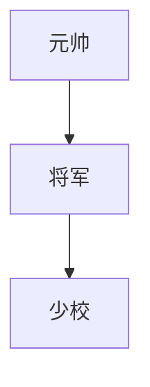

[TOC]

# JSON 类型

> JSON6个类型：数字，字符串，布尔，对象，数组，null

## 数字

JSON中的数字可以是小数，整数，正数，负数，可以使用科学计数法。

`-289`

`22.59`

`5.972e+24`


- **从文本文件test.json中读取数字类型的Json字符串进行反序列化**


```c#
double value = JsonConvert.DeserializeObject<double>(File.ReadAllText("test.json"));  // value is 0.618, it takes 8 bytes
```


- **序列化数字类型的Json字符串字面值**

```csharp
double value = JsonConvert.DeserializeObject<double>("0.618"); // value is 0.618, it takes 8 bytes
```

## 字符串

JSON的字符串必须且只能用双引号包裹，不能使用单引号包裹

JSON字符串内部的双引号需要加转义字符表示` \"`

JSON字符串内部使用`\\`表示`\`

JSON字符串内部的控制字符仍旧采用转义字符表示，如换行符`\n` 回车符`\r`制表符`\t` 空字符`\0` 响铃`\a` 退格`\b`


- **从文本文件test.json中读取字符串类型的Json字符串进行反序列化**


```csharp
string value = JsonConvert.DeserializeObject<string>(File.ReadAllText("test.json"));  // value is 0.618, it takes 5 bytes.
```

- **序列化字符串类型的Json字符串字面值**

```csharp
string value = JsonConvert.DeserializeObject<double>("\"0.618\"");  // value is 0.618, it takes 5 bytes.
```

## 对象

对象类型是使用逗号分隔的名称-值对构成的集合，并使用花括号{ }包裹。

使用json表示对象时，属性名(key)必须用双引号包裹，对于Json本身而言，key名可以是包含空格，#，% 等的字符串，但是为了可移植性兼容更多的语言，尽量不要使用特殊字符。

value如果是字符串类型，可以是任何形式任何字符。 value并不需要总被双引号包裹，value是字符串时，必须使用双引号,如果是数字，布尔值，数组，对象，null，这些都不应被双引号包裹。

```csharp
Button btn = JsonConvert.DeserializeObject<Button>("{\"Tag\":2021}");
btn = JsonConvert.DeserializeObject<Button>("{}");
btn = JsonConvert.DeserializeObject<Button>("null");
```

## 数组

数组是值的集合，每个值都可以是字符串，数字，布尔值，对象和数组中的任何一种，数组必须被方括号[ ]包裹，且值与值之间用逗号隔开。

["str1","str2",null, 5.0] 这种表示对于json是合法的，但是我们应该尽量避免这样做，因为这种json 数组可以被动态语言正确解析成列表数据类型，但是像C#，java，C++这种强类型语言无法解析成泛型数组或泛型列表数据类型。

```csharp
ArrayList list = JsonConvert.DeserializeObject<ArrayList>("[1,true,\"123\",{},[1,2]]");
foreach (var item in list)
{
    Console.WriteLine(item.GetType().Name);
}
/*
Int64
Boolean
String
JObject
JArray
*/
```

## null

null表示一个没有值的值，必须是小写。
文本文件 test.josn

```tex
null
```

```c#
JsonConvert.DeserializeObject<int?>(File.ReadAllText("test.json"));
```

C#源码

```C#
JsonConvert.DeserializeObject<int?>("null");
```


# JSON转义

https://www.bejson.com/   可利用该网站提供的JSON转义工具进行转义。

原始表达：John Say "Bye"

Json文本形式："John Say \\"Bye\\"" 

C#字面值形式：`"\"John Say \\\"Bye\\\"\""`（Json文本形式经过转义得到的Json代码形式）

注意：使用双引号包裹Json文本形式经过转义后得到的字符串，便可以得到C#字面值形式。


> 所有的类型都是文本，字符串类型多个双引号。


# 重要

https://stackoverflow.com/questions/41088492/json-net-contractresolver-vs-jsonconverter

## Json.net

JsonSerializer 有很多有关如何序列化的属性，这些属性在正式序列化前设置好，会在序列化时决定如何序列化。

JsonSerializer serializer = new JsonSerializer();

serializer.Property = xxx;

serializer.Serialize(object);


JsonSerializerSettings的属性会全部赋值到JsonSerializer的属性上。所以，可以在序列化时把参数全部直接给到JsonSerializer 实例，也可以先给到Settings间接给到实例。

每次序列化时，都会实例化一个JsonSerializer实例！，当然也可以提前缓存实例，这样性能就会高一点点。


每一个属性都映射一个JsonProeprty，JsonProperty里面讲述了如何序列化这个属性


### 循环引用解决方案

```c#
class Soldier
{
    public string Name { get; set; }
    public Soldier Parent { get; set; }
    public List<Soldier> Child { get; set; } = new List<Soldier>();
}
Soldier marshal = new Soldier();
marshal.Name = "元帅";
Soldier general = new Soldier();
general.Name = "将军";
Soldier major = new Soldier();
major.Name = "少校";
marshal.Parent = null;
marshal.Child.Add(general);
general.Parent = marshal;
general.Child.Add(major);
major.Parent = general;
```


如下方式序列化，会抛出异常。
```c#
JsonConvert.SerializeObject(marshal);
```
异常信息：
```tex
Newtonsoft.Json.JsonSerializationException: 'Self referencing loop detected for property 'Parent' with type 'WpfApp1.Soldier'. Path 'Child[0]'.'
```

异常原因：在序列化元帅的第一个子元素时，检查到Parent属性又要序列化元帅，形成无限循环，导致异常。

设置PreserveReferencesHandling = PreserveReferencesHandling.Objects或All，可以解决循环问题。

```c#
JsonConvert.SerializeObject(marshal,new JsonSerializerSettings()
{
    PreserveReferencesHandling = PreserveReferencesHandling.Objects
}
```

```json
{
  "$id": "1",
  "Name": "元帅",
  "Parent": null,
  "Child": [
    {
      "$id": "2",
      "Name": "将军",
      "Parent": {
        "$ref": "1"
      },
      "Child": [
        {
          "$id": "3",
          "Name": "少校",
          "Parent": {
            "$ref": "2"
          },
          "Child": []
        }
      ]
    }
  ]
}
```

```c#
JsonConvert.SerializeObject(marshal,new JsonSerializerSettings()
{
    PreserveReferencesHandling = PreserveReferencesHandling.All
}
```

```json
{
  "$id": "1",
  "Name": "元帅",
  "Parent": null,
  "Child": {
    "$id": "2",
    "$values": [
      {
        "$id": "3",
        "Name": "将军",
        "Parent": {
          "$ref": "1"
        },
        "Child": {
          "$id": "4",
          "$values": [
            {
              "$id": "5",
              "Name": "少校",
              "Parent": {
                "$ref": "3"
              },
              "Child": {
                "$id": "6",
                "$values": []
              }
            }
          ]
        }
      }
    ]
  }
}
```

给数组和对象加一个类似主键的属性，碰到循环引用时，用主键表示。注意：反序列化时请使用相同的JsonSerializerSettings。

PreserveReferencesHandling有4种值：All、Objects、Arrays、None。JsonSerializerSettings默认使用的是None。Arrays表示只给Json数组添加主键，Objects表示只给Json对象添加主键，All表示给二者都添加主键。在应用时，要分析造成循环引用的原因，选择合适的枚举值。对于树状组织数据结构，建议使用Objects，因为Arrays不是造成循环引用的原因，而All序列化得到的Json字符串更冗余复杂。

### ReferenceLoopHandling和PreserveReferencesHandling的区别

ReferenceLoopHandling无法恢复到原来的数据结构。

### 处理枚举

### 序列化成缩进形式的Json文本

```c#
string json = JsonConvert.SerializeObject( new Employee {Name="Jack",Age=30} ,Formatting.Indented);
```

### 格式化紧凑形式Json为缩进形式

```c#
string jsonIndented = JToken.Parse("{\"Name\": \"Jack\",\"Age\": 30}").ToString(Formatting.Indented);
```

### 缩进和紧凑形式的优缺点

缩进形式的Json排版好，更易读。但是添加了大量空白字符，导致序列化后得到的Json长度变长，那么存储的成本会变高，CPU处理的时间会变长，网络发送占用的带宽更高，耗时更久。
建议：因为网络资源成本比较高，存储成本与CPU成本相对较低，所以网络发送紧凑形式的Json，进程收到后先缩进再打印日志和储存。


# JsonConverter


